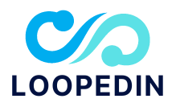

<h1 align="center">
  <a href="http://loopedin-dev.herokuapp.com" target="_blank">
    
    </img>
  </a>
</h1>

<h3 align="center">Connecting Software Engineers</h3>

  
  
  

 

## Introduction
LoopedIn is a social media web app that allows you to get to you to get to know your fellow software engineers better.

## Searching for Resources on Technical Topics
The fast reactive search functionality is the perfect tool to find a resource on your next technical challenge. Let's say you are looking for a fellow software engineer to help with React.  Just start typing in the search bar and the bio view filters instantly.
---- Insert screenshot ----

## Licenses

## Contributors
<ul>
  <li>
    Michael Lam
    
      
  </li>
</ul>